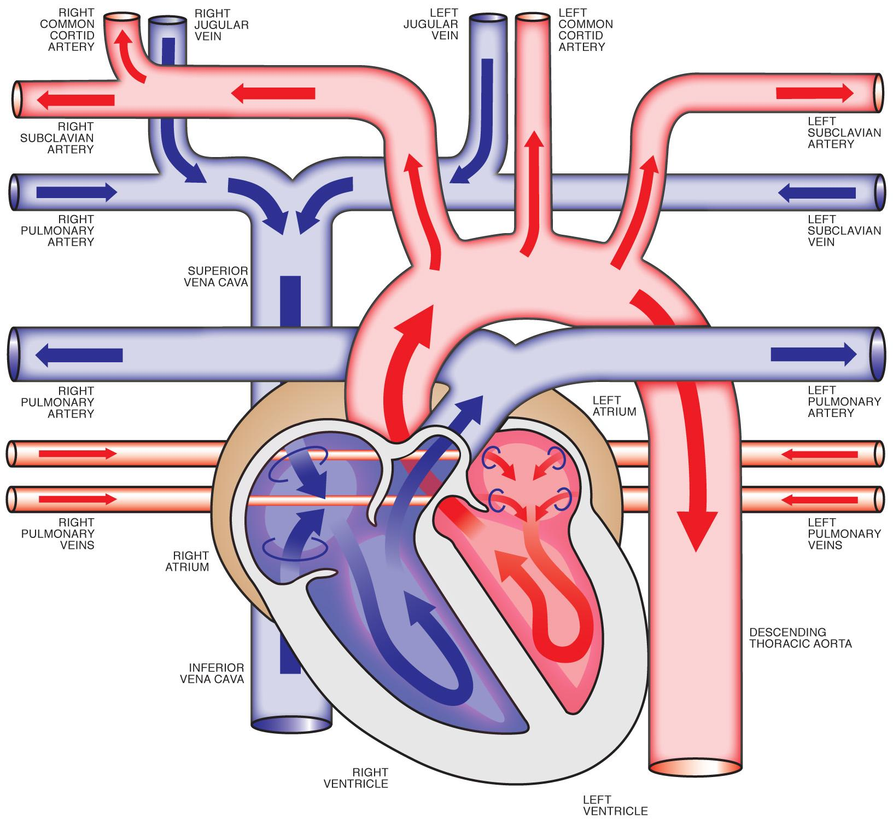

`2016/09/16`
# Biology Heart Experiment

## Dissection of a heart

### Part A

1. The heart is sort of a triangke, it's a light brown with some of white spots that could be fat mainly around the aorta and pulmonary altery.
2. The atria are a light pink, with some red pinkish details.
3. We think that the oblique shallow is a vein, as it seems to have blood that had run through it, there are fats around and it's a dark purple color.

###Part B
- We can count 4 cavities.
- We suppose they are connected but we can't feel when the ore and we can't feel our finger going through.

###Part C
When we put it through the right atrium, the water comes out of the small artery that is while on a elastic and when we put it through the left oresit comes out through the big one.
We figured out that the right and left atrium veins and the white things are arteries.  
The next atrium is connected to the aorta and the left to the pulmonary artery  
Both of these,when we put water in them, the water **DID NOT** come out of the atrium so the flow only goes one way.

###Part D
The aorta side is way thicker with more fiber and mroe white, the walls are very thick but doesn't have much fat, the pulmonary artery side is not as dense, with less fibers.  
We think that the arter is "around" the aorta.

We explored the coronary artery and found out it wasn't very wide or easy to explore.