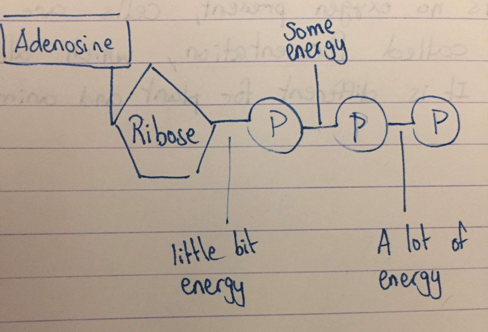
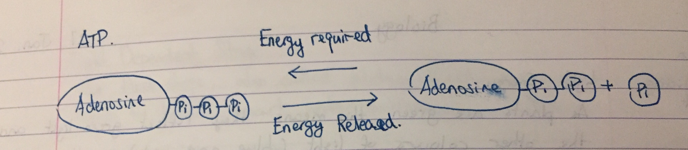
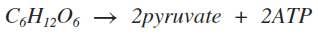
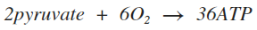
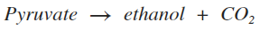
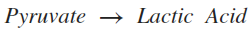
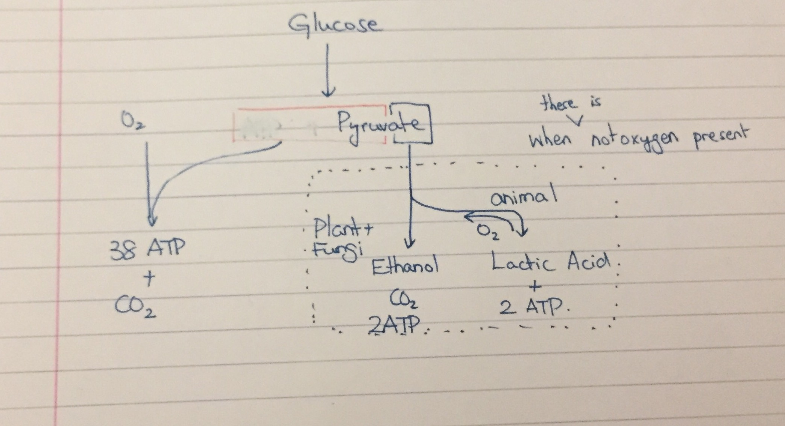

`03 Feb 2017`
# Cellular Respiration
Cellular Respiration is carried out by the **mitochondria** of cells. It is the process of using **glucose** (sugar) and **oxygen** to make energy.

It happens in both **plant and animal cells**.

### ATP
Energy from the glucose is transferred to a special molecule, ATP (**Anedosinetriphosphate**), which is the energy currency of the cell. The more ATP made, te more energy there is.

Although cellular respiration is made up of a series of reactions, it occurs in two main steps:

1. **Glycolysis** (splitting of glucose) - glucose is split into two pyruvates and 2 ATP molecules. This happens with or without oxygen.

> This stage occurs outside the mitochondria.

2. In the presence of oxygen, pyruvate is further broken down and makes 36 ATP, water, and carbon dioxide

## Cellular respiration
In the presence of oxygen, about 38 ATP are able to be made from one molecule of glucose. This is **aerobic respiration**, in the presnce of oxygen.

### What happens when no oxygen is present?
Cells may not always have access to oxygen, especially for short periods; howeer, they will still need energy.

When there is no osygen present, cells are able to go through a process called **fermentation**, which allows them to make some energy. It is different for plant and animal cells.

### Fermentation
For the process of fermentation:

1. stage one, glyolysis still occurs, this happens in all 3 types of cell. (plant, fungi, animal)
2. Animal and plant cells don't have the sam process here:
	- **Yeast Fermentation** (Fungi + Plant). 
	- **Lactic Acid Fermentation** (Animal).

#### Yeast fermentation	
in yeast, during the second step, pyruvate is turned into ethanol and CO2. This process is **irreversible**.

#### Lactic Acid Fermentation
Lactic acid fermentation occurs in animal cells, such as human muscle cells. This process is **reversible**.

