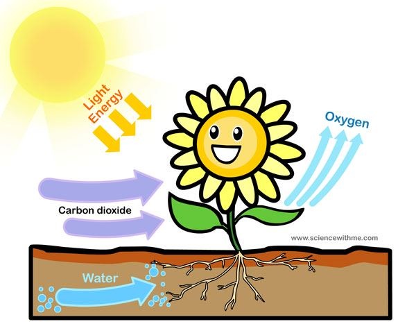
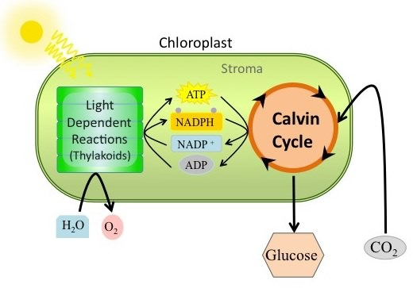
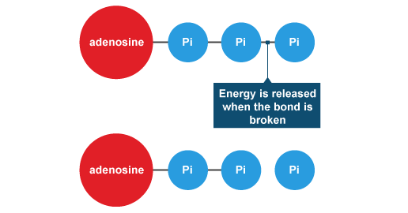

`2017/01/27`
# Photosynthesis

plant cells are **autotrophs**. (They can make their own food)  
Plant cells make their own food through a process called **photosynthesis**, which occurs in **chlorophyll**, a green pigment found in **chloroplasts**.

	Photo = something using light
	Synthesis = To make
	You don't have to memorize the things above

## Photosynthesis

6CO2 + 6H2O -> C6H12O6 + 6O2 
 
> The reactants are: CO2 (**Carbon dioxide**), H2O(**Water**).  
> The products are: C6H12O6 (**Glucose**), O2 (**Oxygen**)

Photosynthesis is made up of multiple reactions, but occurs in two main stages:

- Light Dependent Stage - **photosynthesis**
- Calvin cycle - **carbon fixation**

### Light dependent stage
The first stage, also called photosythesis, requires the energy from light to break apart water molecules:  

**2H****2****O** **-> 2H****2** **+ O****2**
### Calvin cycle 
The second stage, also called carbon fixation, does not require light, but can be affected by temperature.

> **Vocabs**:  
> ATP = Adenosintriophosphate  
> ADP = Adenosindiphosphate

## The absorption of light
Among 100% of the light energy hit onto the leaf:

- 10% is reflected
- 5% is transmitted (went through the leaf)
- 85 is aborbed:
	- 80% is lost through evaporation of water
	- 4% is used to heat the plant
	- Only 1% is for photosynthesis

## Light Energy
As plants are green, this means they reflect green light and absorb the other colours of light (blue and red) on the spectrum. It is the energy from the blue and red portions of the spectrum which is for photosynthesis.

> **Notion: A colour reflects the light of its same colour.**

## Limiting Factors
The rate of photosynthesis (how fast ut can occur) is affected by 3 main factors, these limit the rate of reaction and so are called **limiting factors**:

1. Light
2. Temperature
3. Carbon dioxide

### image sources:
- [ADP and ATP diagram](http://www.bbc.co.uk/bitesize/intermediate2/biology/living_cells/respiration/revision/2/)
- [calvin diagram] (http://devarchive.cnx.org/contents/61cfbd85-9ef4-4791-9742-d45491848a44@6/calvin-cycle)
- [photosynthesis diagram] (http://sciencewithme.com/learn-about-photo-synthesis/)