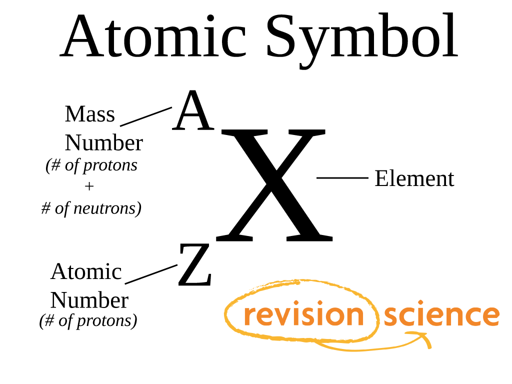

`2016/09/09` Friday
# Introduction
### Terminology and definition
- Element:  
 An **element** is a pure substance that contains only one type of atom.
- Mass number:  
 The number of protons and neutrons in an atom.
- Atom:  
 An **atom** is the smallest part of an element that can be recognised as that element. (simplest building blocks of element)
- Atomic number  
 The number of protons in an atom.
- Molecule:  
 Two or more atoms bonded together.
- Mendeleev:  
  Russian scientist who arranged the found elements in the periodic table, and left gap for undiscovered ones. 
- Electron:  
	- negatively charged
	- orbiting outside the nucleus
- Isotope:  
  The same atom with different number of neutrons.

### Reading the periodical table

### Proton, Neutron, Electron
Particles | Mass / kg | Charge / C | Relative mass | Relative charge 
--- | --- | --- | --- | ---
Proton | 1.0 x 10-6 | 1.602 x 10-19 | 1 | + 1  
Neutron | 1.675 x 10-27 | 0 | 1 | 0
Electron | 9.109 x 10-31 | 1.602 x 10-109 | 1/1836 (**virtually** nil; negligible)| - 1

### Exercise
 | Protons | Neutrons | Electrons | Charge | Atomic number | Mass number | symbol
 --- | --- | --- | --- | --- | --- | --- | ---
 A | 19 | 21 | 19 | **0** | **19** | **40** | 40K
 B | 20 | **20** | **20** | 0 | **20** | 40 | 40Ca
 C | **11** | **12** | 10 | **+** | 11 | 23 | 23Na+
 D | **6** | **6** | 6 | **0** | 6 | 12 | 12C
 E | **92** | 143 | 92 | **0** | 92 | **235** | 235U
 F | **6** | 7 | 6 | 0 | 6 | **13** | 13C
 G | 16 | **16** | 18 | **2-**| **16** | 32 | 32S2-
 H | 13 | 14 | 10 | 3+ | 13 | 27 | **27AI3+**

