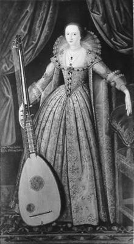

`2016/09/12` Monday
# Song
<h2>By Lady Mary Wroth</h2>
### Define the qualities of love (features / characteristics):
* use metaphors and similes:
	- love is ...
	- love is like ... 
- love is ... 
	- caring, eternal
	- honest
	- selfless
	- happiness and sadness
	- passionate, patient, blind 
- love is like ...
	- a bird
	- fire, once it starts it never goes out
	- a maze
	- the water for fish

### Wordle
 
##### Brainstrom: CHILD
- honest
- reckless; do not realize impact
- impressionable
- hard work
	- relationship
	- physical
- **demanding**
	- attention
	- want love
- dependent
- self-centered, immature
- innocent, naive
- open-minded   

## Poem  
### Lady Mary Wroth 1587 - 1653

- An English poet of the Renaissance.
- A member of an illustrious literary family, her father was poet Sir Robert Sidney.
- Recognised and admired by a number of poets during her day, including Ben Johnson who dedicated his play *The Alchemist* (1621) to her.
- Educated by tutors, an accomplished scholar, musician, and dancer.
- She had an arranged marriage in 1604; it was a deeply unhappy union.
- 1614 her husband died away, but she was still unhappy. She had a child, but the death of her husband left her in poverty.  

- A pioneer: she wrote the first prose fiction and the first sonnet sequence published by a woman in England.
- Pictured holding an archlute (symbol of poets), not the gloves or fan customary in female portraits of the time.

# ANNOTATION
