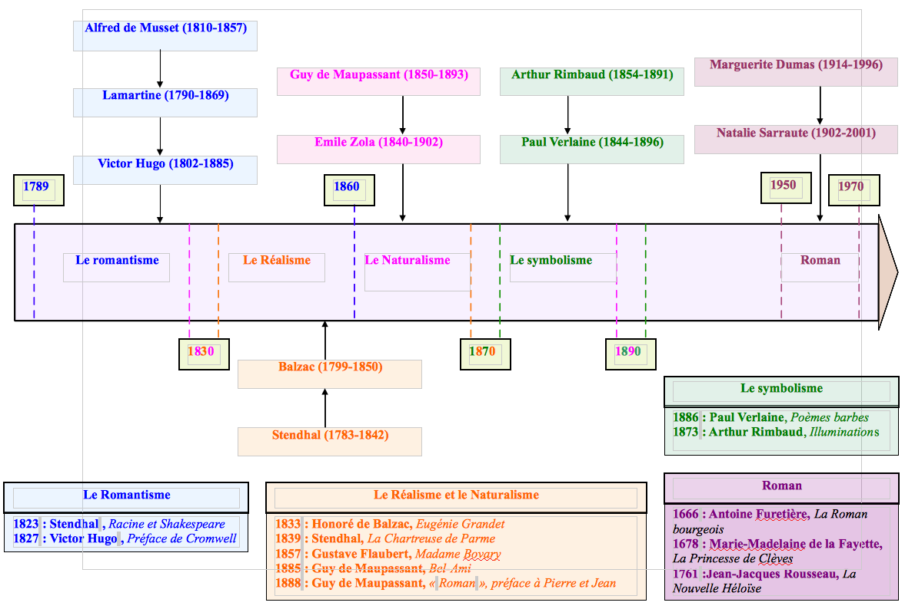

<h1 style="color: red">II. Le réalisme et le naturalisme</h1>

Le réalisme et le naturalisme sont deux mouvements artistiques du XIXe siècle. On appelle mouvement un groupe d'artistes (écrivains, peintres, musicians, photographes, cinéastes etc.) qui crée des œuvres en ayant une même conception de l'art, de la beauté, de la vie … Le réalisme et le naturalisme, au XIXe, coexiste avec le romantisme (Hugo, Chopin). On connaît également dans d'autres époques, d'autres mouvements: 

- au XVIIe, le classicisme (Racine, Molière…);
- au XVIIIe, les Lumières (Voltaire, Rousseau…);
- au XXe, le surréalisme (Breton, Aragon, Dalí…),  
Beat generation (Ginsberg, Kerouac …).  

Au XIXe siècle, l'Europe et la France connaissent une situation politique très instable. Il y a des guerres civiles en permanence. En France, trois régimes politiques se disputent le pouvoir: les Républicains; les monarchistes ou royalistes; les impérialistes ou Bonapartistes. Cette situation explosive est compliquée par la révolution industrielle. La technique se développe, on crée des usines, la population rurale devient urbaine, les paysans deviennent des ouvriers. On assiste à une nouvelle lutte entre deux classes sociales, le patronat (propriétaire des usines) et le prolétariat (des ouvriers). Karl Marx propose une théorie de cette lutte des classes, et les ouvriers se regroupent en syndicats et partis politiques pour défendre leur droit. Les grands romans réalistes et naturalistes vont être le reflet de ce contexte politique et social. 

# Séance 1
## Balzac, *Le Colonel Chabert*, p. 58

Cet extrait se situe au tout début du roman de Balzac. Il raconte la première rencontre des deux personnages principaux, le colonel Chabert et Derville, l'avocat qui va le défendre et l'aider à retrouver son identité. Cet extrait peut être étudié en suivant deux axes: d'abord, une description réaliste, ensuite un personnage presque surnaturel. 

**Rappel:**

	Pour faire un commentaire, il faut: 
	- citation
	- procédé
	- interprétation

### I. Une description réaliste

#### Questions p. 59

1. Identifiez les étapes de la description. Montrez que la progression se fait de manière très précise. 

		- l.5 à 9
		impression d'ensemble, immobilité
		- l.9 à 20
		description de détaille: Derville dévisage Chabert de tête au pied
		- l.20 à 32
		impression d'ensemble
		- l.33 à fin
		mouvement, cicatrice

2. Comment la dégradation (physique, sociale et mentale) de Chabert est-elle soulignée? 

		- physique:
		vocabulaire péjoratif
		- mentale:
		mort vivant
		- sociale:
		solitude, périphrase
 
#### Arguments
- Comparaison «figure de cire»
- Accumulation de détails
- Vocabulaire médicale («symptom» etc.)
- Comparaisons culturelles

#### Schéma
	I. Une description réaliste
		A) Une description détaillée
		B) Une description critique
=> Axe + 2 sous-parties

Pour commencer, nous pouvons analyser dans ce texte la manière dont Balzac rédige une description réaliste, à travers une description très détaillée et un portrait critique du personnage de Chabert. 

### II. Un personnage presque fantastique
- immobilité
- ressemblance à un fantôme
- l'angoisse de Derville
- lumière sinistre, etc.

# Séance 2
## Méthodologie: le commentaire
L'épreuve du commentaire est une épreuve d'analyse de texte. Pour construire un commentaire, il faut suivre plusieurs étapes: 

Durée: **2h**
### 1. Lecture du texte (2 fois) 10'
### 2. Idées immédiates 5'
### 3. *Carte d'identité du texte* 10'
- Auteur
- Époque
- Titre
- Genre
- Type
	- narration
	- description
	- information
	- argumentation
- Thèmes (2 ou 3)
- Registres -> **p.460**
	- pathétique
	- lyrique
	- ironique
	- fantastique
	- épique

### 4. *Analyse détaillée* 30'

	- Citation
	- Procédés
	- Interprétation
### 5. *Plan* 10'
	I.
	- A
	- B
	II.
	- A
	- B
**(5')**
### 6. *Rédaction* 40'
- **Introduction**
	- contexte
	- Texte
	- Plan (Axe)
- **Conclusion**
	- résumé de l'analyse
	- ouverture

**(10')**

# Séance 3
## *Le Père Goriot*, Balzac, p.82
### I. Une scène d'enterrement réaliste
### II. La critique de la société