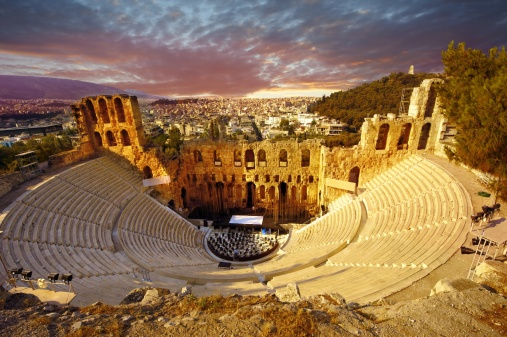

`2016/09/07` - `2016/09/12`
# Ancient Greece
### Brainstorm
- Democracy 
- Mythology 
- φ (philosophy) 
    - ex. *Socrates, Aristotle, Plato*
- Economy-trade
- Olympic games
- Athens
- city states 
- War/conquest 
- job specialization
- religion 
- Art
    - sculpture
    - Theater
- Architecture

### __Ancient Greek governments__

- Monarchy 
  - king inheritance
- Oligarchy 
    - rich people rule
- Tyranny 
    - power taken by force 
    - ≠ bad; benevolent tyrants exist: those who take over the oligarchical government
- Democracy

### Chronology
- Mycenaean Age 
    - 1600 - 1100 BC
    - Kingdom of Mycenae
    - known through myths
- Dark Ages
    - 1100 - 750 BC
    - writing disappears: 
        - civil strikes?
        - Dorian invasion?
- Archaic Period
    - 750 - 500 B.C. 
- Classical period (_the Golden Age_)
    - economical, Cultural, political height
    - __Greco-Persian Wars__
        - 490 - 479 BC
    - Birth of __Herodotus__ (484 - 420 BC)
        - 484 BC
    - Delian League
        - 477 BC
    - __Peloponnesian War__
        - 431 - 404 BC
- _Sparta_
    - warriors
    - strong disciplines
    - Oligarchy (__failed to proceed to Democracy__)

### The Ancient Greeks: Crucible of Civilization (History Documentation)
  
### Aspects of Ancient Greek covered in the video:  
- Art/Architecture *(culture)*
- Greco-persian war *(war)*
- Pericles impact/Athens  
Rise of Athens
- Democracy *(government)*
- Downfall of Athens
- Religion
- TRADES *(economy)*
- *(INTELEECTUAL)*

### Democracy in Ancient Greek
- open
	 - government of citizens for citizens
	 - `ostracism`
	     - vote to exile a person considered to be in possession of too much power (voted by the assembly)
	 - open; really?
- structure
	- Assembly- *Ecclesia*
	 - 30,000 - 40,000 citizens (~10% of population)
	 - all citizens could attend the assembly; around 5000 attend each assembly
	     - citizens: male, without debt, both parents being Athenian  
	     - (only one was required before Pericles) 
	     - others (i.e. women, baby, slaves, foreigners) excluded
	- Bouletal *(the council of the five hundred)*
	 - a paid job
	 - 500 randomly picked citizens
	 - who prepared the laws (for the assembly to vote to pass) and made sure the laws were followed through
	- Military strategics 
	    - 10 generals

## Essay topic:
Discuss: "5th century BC, a time and place of extraordinary cultural and intellectual fertility."
### Structure
1. Intellectual achievement
	1. Emergence of critical thinking
		- Herodotus: father of history
		- Socrates / Plato / Aristotle
	2. Development of scientific methods
		- Hippocrates
		- Pythagoras
	3. Development of new forms of government
		- emergence of democracy
		- development of rhetoric & sophism
2. Arts / culture
	1. Architecture 
		- Parthenon
		- Temple of Athena Nike
	2. Greek pottery
		- Amphoras
		- Red figure painting
	3. Drama
		- Sophocles

