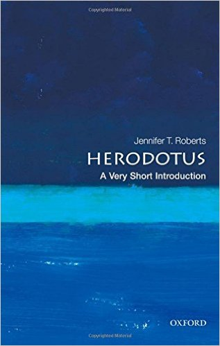

# Renaissance
## Introduction
- 15th - 16th C.
- moving away from the Middle Ages (5th to 15th C.) to the beginnings of Modern Era
- The term *renaissance* was not used during the renaissance - 19th century
- gave birth to the "modern individual"
- is a time where we see *critical thinking* emerging in all dimensions, from humanism to religion  
	- ex. protestant reformation, questioning geocentric system, discovering new lands

### Important dates
- **1450** Gutenberg: invention of the first printing press  
	- enabled mass learning, founded the basis of modern learning 
	- revolutions that changes the way people think:
		- oral tradition to written tradition
		- invention of the printing press
		- internet
- **1455** 42 line bible
	- first important book printed using the moving printing press
- **1492** Christopher Columbus discovered America
- **1452 - 1519** Da Vinci
	- architect of the renaissance
	- painter, architect, sculptor scientist, etc. and more
- **1511** The praise of Folly - Erasmus
	- Dutch humanist, catholic theologist
	- traveled extensively throughout Europe
	- tried to reform the catholic church from within
	- father of *humanism*
- **1517 - 1595** Martin Luther - 95 thesis
	- catalyzed for the *protestant reformation*
- **1543** On the revolution of Celestial Spheres - Copernicus
	- published after his death
	- opens up the way to many scientific discoveries
- **1564 - 1642** Galileo
	- Italian mathematician, physicist, astronomer, philosopher
	- played a key role in the scientific revolution
	- father of observational astronomy, father of modern physics, father of modern science 

### Key themes
1. Humanism
	- goes back to the 7 Greek liberal arts subjects: 
		- *trivium*: grammar, logic, rhetorics
		- *quadra*: arithmetic, astronomy, music, geometry
	- study of the Green and Roman language, culture and philosophy
	- became central to the renaissance thought
2. Church & State
3. New Worlds
4. Science & Philosophy
5. Art

### Documentary: Da Vinci, the man who wanted to know everything

