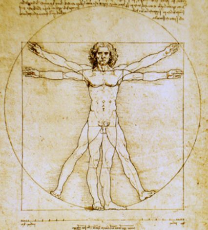

# Renaissance
## Introduction
- 15th - 16th C.
- moving away from the Middle Ages (5th to 15th C.) to the beginnings of Modern Era
- The term *renaissance* was not used during the renaissance - 19th century
- gave birth to the "modern individual"
- is a time where we see *critical thinking* emerging in all dimensions, from humanism to religion  
	- ex. protestant reformation, questioning geocentric system, discovering new lands

### Important dates
- **1450** Gutenberg: invention of the first printing press  
	- enabled mass learning, founded the basis of modern learning 
	- revolutions that changes the way people think:
		- oral tradition to written tradition
		- invention of the printing press
		- internet
- **1455** 42 line bible
	- first important book printed using the moving printing press
- **1492** Christopher Columbus discovered America
- **1452 - 1519** Da Vinci
	- architect of the renaissance
	- painter, architect, sculptor scientist, etc. and more
- **1511** The praise of Folly - Erasmus
	- Dutch humanist, catholic theologist
	- traveled extensively throughout Europe
	- tried to reform the catholic church from within
	- father of *humanism*
- **1517 - 1595** Martin Luther - 95 thesis
	- catalyzed for the *protestant reformation*
- **1543** On the revolution of Celestial Spheres - Copernicus
	- published after his death
	- opens up the way to many scientific discoveries
- **1564 - 1642** Galileo
	- Italian mathematician, physicist, astronomer, philosopher
	- played a key role in the scientific revolution
	- father of observational astronomy, father of modern physics, father of modern science 

### Key themes
1. Humanism
	- goes back to the 7 Greek liberal arts subjects: 
		- *trivium*: grammar, logic, rhetorics
		- *quadra*: arithmetic, astronomy, music, geometry
	- study of the Green and Roman language, culture and philosophy
	- became central to the renaissance thought
2. Church & State
3. New Worlds
4. Science & Philosophy
5. Art

### Documentary: Da Vinci, the man who wanted to know everything

## Ch 2 Humanism
### Movable printing press

- low cost
- mass production + distribution

=> Books, maps, data were able to be shared for collaborative knowledge.

- More books have been produced by the year 1500 than all books produced before 14th century. 
- Knowledge was being repackaged, revolutionized the study of all fields
- new ways of studying, new ways of thinking
- Shifted from oral knowledge to reading and writing

Statistics:

- By 1500, between 6-15 million books existed in 1400 different editions. 
- In the 16th century, in England alone, there were 10 000 different editions and at least 150 million books were published for population of about 80 million. 

=> Without the printing press and mass dissemination, humanism would not have been possible.  
=> shapes the mind of the world today (literal tradition -> printing press -> internet)

### Humanists
- They used text from the past to better transform and understand their own time.

- It promoted the study of classical works as a key a to create successful, cultivated, civilized individuals to use this scale to succeed in the fields of politics, trade and religion. 
- In other words, it convinced students and employers that the study of classical texts provided the practical skills necessary for future careers like ambassadors, accountants, lawyers and priests. (how to function in the society)
- It prepared for what we call a "free man" in Ancient Greece
	- liberal arts
	- in other words, what the humanists did is to focus on the liberal arts / skills rather than specific vocational studies. 
- Teaching on the basis of ancient texts how to learn to learn

### History
- Started in the 14th century with an Italian humanist philosopher Petrarch who took up Cicero's distinction between the role of a *philosopher* and the role of an *orator*.
	- ρ / philosopher: quest for the truth
	- orator: rhetoric / persuasion

### Women
There is no real social / educational opportunities for most women.

Men desired to keep women in a domestic function.  
Even humanist did the same: *"not only could my wife not understand the books, she is not allowed to lay hands on them".*

=> there existed exceptions where women acquired a role in the renaissance, nevertheless the situation was difficult for them. 

### Key humanist: Erasmus of Rotterdam
- Dutch renaissance humanist, catholic priest
- => Erasmus exchange
- published *Praise of Folly*, which is a satire of the corruption and complacency of the church
- at the core of his activity was writing, and the printing press was again what allowed him to do that
	- portrait `p. 53`: reflects the dimension of importance of writing and reading during the renaissance
- *Education of a Christian Prince*

### Politics
- *The Prince*, **Machiavelli** (1513)
	- how to obtain power and maintain it
	- Machiavelli's intentions were to discuss political theory
- *Utopia*, **Thomas More** (1516)

### Conclusion
Humanism  
=> allowing a new approach to books / knowledge and collaborative learning

## Ch 3 The Church and the State
- The Church was put into challenge from spiritual and scientific aspects. 
- At the time, there was a complex relationship between religion and various aspects of renaissance. 
- Unlike today, it was very hard to separate religion from politics, art and learning at the time of the renaissance. 
- Despite the fact that it faced perpetual conflict and division, the Church was everywhere, whether was in the politics, in the learning and the teaching, or in the arts. 
- In 1550, 5000 of the 60 000 population in Florence were clergy.  
=> 10% :huge percentage  
=> The Church had a very powerful role, and was a very very powerful institution, despite the fact that it was put in questioning
- protestantism + catholic counter-reformation shapes the christian religion today.
- **Wars of religion** between *1524* - *1628*
	- Northern Europe (except Ireland and a small portion of England) turned protestant
	- Southern Europe remained catholic
	- Calvinist in Germany, Switzerland and other religion in England
- re-emerge of critical thinking => Church was constantly put under questioning from scientific, art and other aspects such as the discovery of the new world.

## Ch 4 Brave new worlds
- What is Ptlomey's *Geography* and why is it important?
- Christopher Columbus, Vasco da Gama, Ferdinand Magellan: what motivated their voyage, what did they discover and what was the impact?

### Ptolemy's *Geography* and its importance
- Ptolemy: Roman citizen in Egypt
- wrote *Geography*, a book with maps
- Renaissance: printing press spreads Ptolemy's *Geography*
- impact: 
	- *mappae mundi*
		- the old map
		- heavily based on religion and placed Jerusalem at the centre of the world (`p. 79`)  
		- => mostly religious, little geographic information given;  
	- Ptolemy's *Geography*: 
		- missing: Americas, Australia / Oceana, Southern tip of Africa, parts of Asia
		- flawed, yet contains much more information than *mappae mundi*
		- => the basis of all geographical discoveries during the Renaissance

### Context
- trades during Renaissance: Portugal, Spain and Italy
	- Portugal, Spain: sea route
	- Italy: land route
- Portugal: geographical advantages: oversea trades
- **1488** Bartolomeu Diaz claimed seeing the southern tip of Africa
	- *Cape of Good Hope*: opened hope to a new route to India

### Voyages, discoveries and impacts
#### Christopher Columbus
- Genoese navigator (`p. 84`)

##### Motivation
- reach India by sea via a new, shorter route westwards (as opposed south0eastern route followed by the Portuguese)
- based himself on Ptolemy's maps, where 
	- Americas don't exist
	- the size of Asia is over-estimated
	- => 
- first proposed his idea to Portugal, but rejected
- Spanish (Castile) supported his idea

##### Discovery
- a new continents: Americas (Bahamas, Cuba and Haiti)
- Columbus thought he almost reached Cipangu (Japan) and Colba (Cuba)

##### Impact
- minimal amount of gold - Spanish king was disappointed
- **immediate impact**: "diplomatic storm" (`p. 85`) / political battle with Portugal (two spheres of influence: Portuguese and Spanish crowns)
	- Treaty of Tordesillas (**1494**)
		- boundary of a straight line line 'running down the Atlantic' 'at a distance of three hundred and seventy leagues west of the Cape Verde Islands'. (`p. 85`)
		- west to the line: Castile (Spain)
		- east to the line: Portugal
- **long-term impact**
	- dissemination of the native population: slaughter + diseases brought by the Europeans
		- *80 million* in **1500** down to *10 million* in **1550** in Americas (`p. 95`)
		- *25 million* down at the beginning **16th century** to *1 million* in **1600** (`p. 95`)
		- lack of labour sources => slavery from Africa 
			- 1525 - 1550: 40 000 slaves
			- between 15th and 19th century, 8-12 million
		- => dark side of the Renaissance + discoveries of the new world
	- thriving gold, silver and slave trade
		- massive influx of silver in Europe
		- improved standard of living 
		- => set the stage for the capitalist society + distinction between the West and the rest
	- new spices, potatoes => savory
- => **shaped the wealth of the western world**

---

#### Vasco Da Gama
##### Motivation
- find a new path to India (Columbus's attempt failed)
- first person to reach India (by sea)

##### Discoveries
- new path to India
- Cape of Good Hope
- spices

##### Impact
- new sciences: astronomy  
	- Jewish navigator / techniques don't apply in the the Indian Sea
	- use of Arabic astronomers, Arabic navigator
- war between Venice and Portugal:  
Venice had monopoly of India before, so he thought that he broke the spice trade    
(Portugal: sea route **vs** Venice: by land)
- Monopoly was gone
	- diplomatic feud
	- Italy and Lisbon (sabotage, prepared to use force)
	- power struggle - who had the routes?

---

#### Magellan
- Portuense explorer

##### Motivation
- searched for a new passage to Moluccas:
	- sponsored by the Castilians
	- Castilians are not permitted to pass through the Cape of Good hope
	- Moluccas is the sole supply of spices (cloves)

##### Discoveries
- departed in **1519**
- then sailed through straits of Magellan
	- dangerous: where the two oceans meet
	- lost 2 ships going through the Straits of Magellan
- reached the Philippines in **1521**
	- got into a local conflict
	- Magellan got killed
- reached Moluccas, then ran the risk of confronting the Portuguese by coming back via the Cape of Good Hope 
	- in **1522** 18 of 240 original crews arrived back in Seville `p.92`  
	=> accidentally circumnavigated
- the Earth is a globe! ≠ initial aim of Magellan: new path to Moluccas

##### Impact
- open exploration + trade
- diplomatic upheavals between the Portuguese and Castilians: who does Moluccas belong to? (land ownership)
- a better representation of Earth using a globe  
=> enabled a much better understanding + knowledge of the world  
- further suppression of the Indigenous population
- desire for unlimited wealth => inequality / polarity of wealth

=> Renaissance was made in collaboration with the East