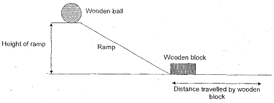

# Pratical: Ball on a ramp

### Experiment:
- all variables that are related (physical concepts)
- in the light of those concepts, explain what you think happens 
	- => what the relationships between variables are

### Variables
- Mass of cup (kg)
- Mass of ball (kg)
- Angle of slope (degree)
- Height of ball on ramp (m)
- Velocity at impact of ball (m/s)
- Initial velocity of ball (m/s)
- Coefficient of friction ramp (unitless)
- **Distance travelled by cup (m)**
- Acceleration due to gravity (m/s-2)
- Air resistance (N)

We are trying to figure out **how the distance travelled by the cup changes**.

	see class note
	/ Mass of cup  -> \ distance travelled
	/ Mball        -> \ Dc

If my experiment shows that it is a linear relationship, then   
	
	Mb ∝ Dc (proportional)  
or   
	
	Mb = k Dc 
where k is constant.

**Guess**: All the relationships are linear  
``Dc  = (k Vi Mb) / (Mc Air)`` where ``Vi = V0 * (Height * cos beta) * Mfriction``